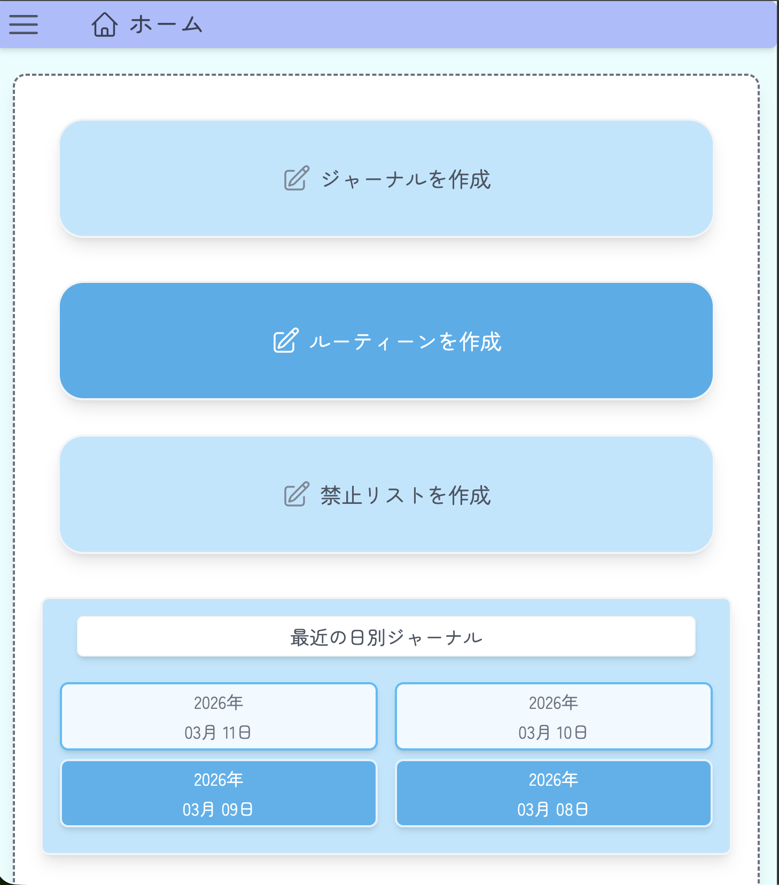
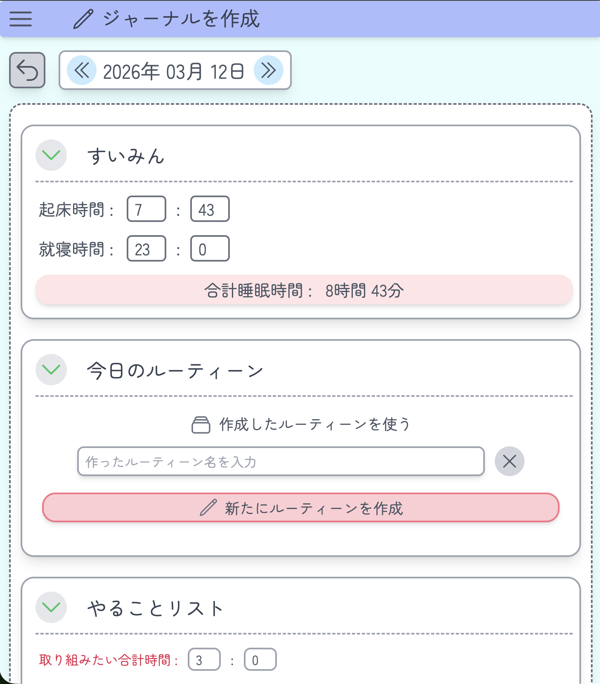
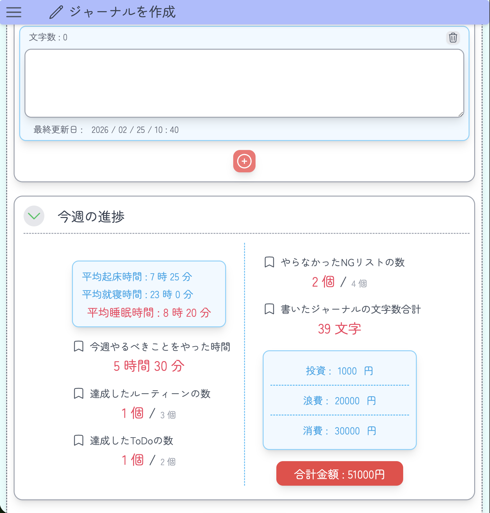
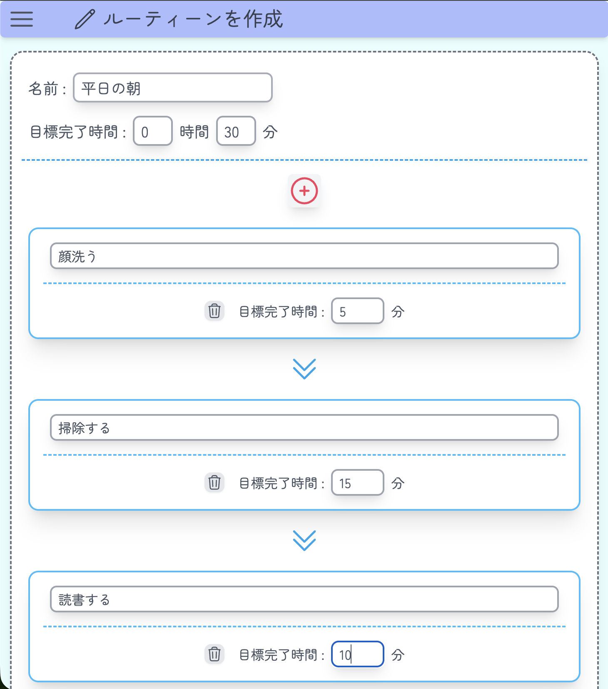
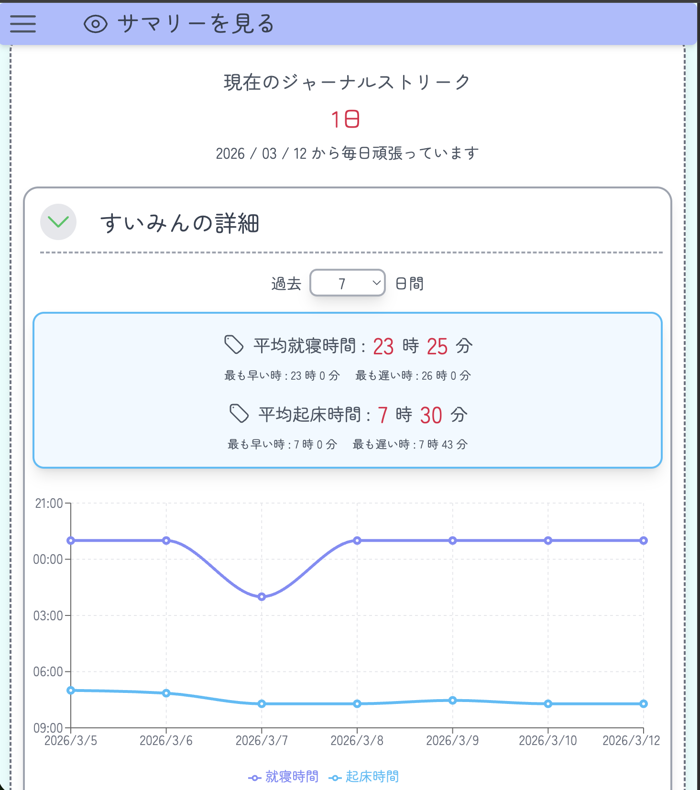

# Online Journal

## アプリ概要

Online Journal は、日々の出来事や目標、ルーティーン、支出などを記録でき、振り返りができるオンライン日記アプリです。
オンラインならではの利点を活かして、過去の記録の統計情報を見たりグラフ化したりすることができます。

## 開発背景

私はiPadで今日のやることリストやジャーナル、支出などを管理していたのですが、iPadでしかできないし、統計的な情報も見れたらいいなと思いました。
なので、PCでもスマホでもどこからでも簡単に管理でき、統計情報も見れるオンラインでのジャーナルアプリを探しました。
しかし、自分の求めているものと一致したものはなかったので、自分で使いやすいものを作りたいと思い、作りました。

## デモ

🔗 https://journal.fujita-issei.com

※ Googleアカウントでログインして利用できます

## スクリーンショット

### ホーム



### ジャーナル作成画面



### 週別の統計情報表示画面



### ルーティーン作成画面



### 統計情報表示画面



## 使用技術

### Frontend
- React
- TypeScript
- Redux Toolkit
- Recharts
- Tailwind CSS
- Vite

### Backend
- Node.js
- Express
- TypeScript
- MySQL

### Infrastructure
- Docker
- Nginx
- VPS (シンVPS)

## 技術選定理由

### Frontend

- React
コンポーネントベースでUIを管理できるので、状態管理と組み合わせて複雑な画面でも作りやすいため

- TypeScript
型の違いによるバグを防いで効率的かつ安全に開発するため

- Redux Toolkit
ジャーナルに書いた情報など、イミュータブルな値がstateとなる部分が多くその変更が簡単で、様々なコンポーネントで使うstateが多いから

- Recharts
統計情報をグラフとして視覚的に表示するため

- Tailwind CSS
通常のCSSよりも素早く開発ができるから

- Vite
create-react-appよりも高速にかつ簡単に開発環境を用意できるから

### Backend

- Node.js
フロントエンドと同じ言語であるTypeScriptで書けるから

- Express
シンプルで柔軟なAPIサーバーを構築するため

- TypeScript
型の違いによるバグを防いで効率的かつ安全に開発するため

- MySQL
ジャーナルなどのデータを管理するため

### Infrastructure

- Docker
自分で作ったものをデプロイするという経験が初めてだったため、開発環境と本番環境との差を減らし、環境構築を簡単にするために使用

- Nginx
フロントエンドとバックエンドのルーティングを行うため

- VPS (シンVPS)
コストが比較的安く、PaaSよりも自分で管理できる部分が多いため

## DB構成

```
users
-----
id (PK)
user_id
email
created_at

routine
-------
id (PK)
routine_id (UNIQUE)
user_id
... other columns

NGList
------
id (PK)
list_id (UNIQUE)
user_id
... other columns

dailyJournal
------------
id (PK)
user_id
target_date
... other columns

weekJournal
-----------
id (PK)
user_id
start_date
end_date
... other columns

monthJournal
------------
id (PK)
user_id
target_date
... other columns

yearJournal
-----------
id (PK)
user_id
target_date
... other columns

forms
-----
id (PK)
user_id
content
email
created_at
updated_at
```

## システム構成
```
Client (Browser / Reactがここで動作)
  │
  ▼
Nginx (Reverse Proxy / HTTPS)
  │
  ├── [UIの取得] ──▶ Frontend (Nginx / 静的ファイルの配信)
  │
  └── [API通信]  ──▶ Backend API (Express / Node.js)
                       │
                       ▼
                     Database (MySQL)
```

ユーザーのブラウザ上で動くReactから、Nginxを入り口としてリクエストを送信しています。
Nginxがリバースプロキシとして機能していて、画面の静的なファイルはfrontendコンテナへ、APIリクエストはbackendコンテナへと振り分けています。
Docker Composeを使用して、frontend, backend, databaseをコンテナで管理しています。

## API

### auth

POST /auth/google
Google OAuthによるログイン

---

### DailyJournal

GET /dailyJournal/getTodayJournal
指定した日のジャーナルをDBから取得

POST /dailyJournal/saveTodayJournal
DBに今日の分のジャーナルを保存

DELETE /dailyJournal/deleteTodayJournal
指定した日のジャーナルをDBから削除

GET /dailyJournal/getYestardaySleepTime
睡眠時間を計算するために、指定した日の前の日の就寝時間をDBから取得

GET /dailyJournal/getDailyDataForSummary
週別、月別、年別の統計データを取るため、指定した期間のジャーナルをDBから取得

---

### Week / Month / Year Journal

GET /weekJournal/getThisWeek /monthJournal/getThisMonth /yearJournal/getThisYear
指定した週 / 月 / 年のジャーナルをDBから取得

POST /weekJournal/saveThisWeek /monthJournal/saveThisMonth /yearJournal/saveThisYear
DBに今週 / 今月 / 今年のジャーナルを保存

DELETE /weekJournal/deleteWeekJournal /monthJournal/deleteMonthJournal /yearJournal/deleteYearJournal
指定した週 / 月 / 年のジャーナルをDBから削除

---

### routine / NGList

POST /routine/save /NGList/save
DBに今作成しているルーティーン / 禁止事項リストを保存

GET /routine/get /NGList/get
DBにある自分が作成した全てのルーティーン / 禁止事項リストを保存

DELETE /routine/delete /NGList/delete
指定したルーティーン / 禁止事項リストをDBから削除

---

### watchPastJournal

GET /watchPastJournal/getDailyJournal
指定した日付、月、年に部分一致する日別ジャーナルを、降順または昇順を指定してDBから取得

GET /watchPastJournal/getWeekJournal
指定した日付、月、年に部分一致する週別ジャーナルを、降順または昇順を指定してDBから取得

GET /watchPastJournal/getMonthJournal
指定した日付、月、年に部分一致する月別ジャーナルを、降順または昇順を指定してDBから取得

GET /watchPastJournal/getYearJournal
指定した日付、月、年に部分一致する年別ジャーナルを、降順または昇順を指定してDBから取得

---

### summary

GET /summary/getCurrentJournalStreak
今日または昨日以前の、DBから何かしら書いてあるジャーナルを取得する

GET /summary/getSleepData
今日から指定された日数前の日から今日までの睡眠時間をDBから取得する

GET /summary/getRoutineData
今日から指定された日数前の日から今日までのルーティーンに関する情報をDBから取得する

GET /summary/getListData
今日から指定された日数前の日から今日までの禁止事項リストに関する情報をDBから取得する

GET /summary/getToDoData
今日から指定された日数前の日から今日までのやることリストに関する情報をDBから取得する

GET /summary/getJournalData
今日から指定された日数前の日から今日までのジャーナルに関する情報をDBから取得する

GET /summary/getMoneyData
今日から指定された日数前の日から今日までの支出に関する情報をDBから取得する

---

### form

POST form/save
お問い合わせフォームに書いた内容をDBに保存

## 主な機能
- Googleログイン
- 日別でジャーナルの作成、編集、削除
- 週別、月別、年別で目標などのジャーナルの作成、編集、削除
- 週別、月別、年別での統計情報の確認
- 日別のジャーナルに組み込める、日々のルーティーンの作成
- 日別のジャーナルに組み込める、日々の禁止事項リストの作成
- フィルタリングして表示される情報を変えれる、過去のジャーナルを見る機能
- 過去の日数を指定して、日別ジャーナルをもとに計算した統計情報と、それをグラフ化したものを表示
- テーマカラー変更
- バグや要望などのお問い合わせフォーム

## セットアップ

### 開発環境

以下のコマンドで開発環境を起動できます。
```
docker compose -f docker-compose.yml -f docker-compose.dev.yml up -d --build
```
フロントエンド
http://localhost:5173

### 本番環境
```
docker compose -f docker-compose.yml -f docker-compose.prod.yml up -d --build
```

## 苦労したこと

起床時間や支出などの大量のデータをオブジェクトとして管理して、バックエンドとやりとりすること
統計情報の計算(例えば、就寝時間を26時と書いても2時とかいても、書かない日があっても統計情報がきちんと計算して表示されるようにする)
生活に関する情報を入力してそれを送信するので、API周りのテスト

## 今後の改善
- パフォーマンスの改善
- SNS機能の追加で、自分のジャーナルやルーティーンを公開できるようにする。
- AI診断モードの追加で、日々のジャーナルに書いた内容から最適な生活改善案を提案する
